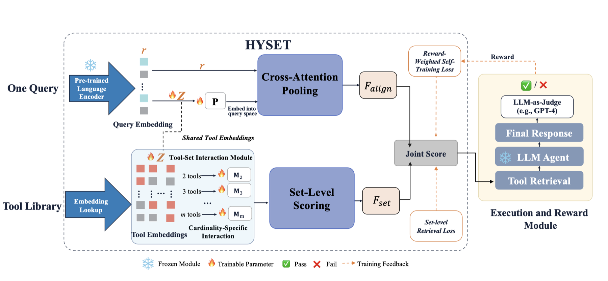
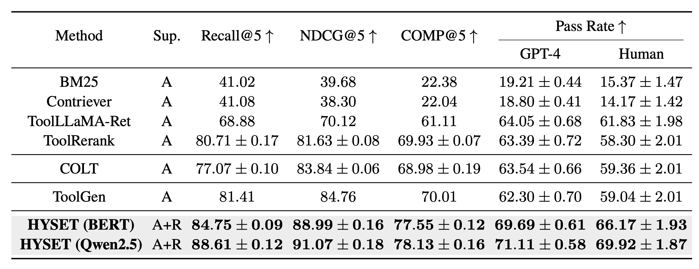

<div align="center">

# Tools Are Not Islands: Set-Level Tool Retrieval for LLM Agents via Query-Conditioned Hyperedge Prediction

<p><em></em></p>

[](https://stormwther18-hyset-demo.hf.space)
[](https://huggingface.co/stormwther18)
[](https://arxiv.org/abs/2607.25718) 
[](./LICENSE)
[](https://www.python.org/)
[](https://github.com/stormwther18/HYSET)

[](https://x.com/stormwther18/status/2082731662337802346?s=20)
[](https://www.xiaohongshu.com/user/profile/65910871000000001f03a6d2)



</div>

Large language model agents increasingly rely on invoking external tools to complete real-world tasks. As tool libraries scale to thousands of APIs, presenting the full library in every prompt becomes impractical, so tool retrieval remains a necessary pre-selection step. HYSET formulates retrieval as query-conditioned hyperedge prediction on a tool co-invocation hypergraph, where the candidate tool set itself becomes the unit of scoring.

<br>

## 📰 News


- **2026-07-30** — Released the <a href="https://arxiv.org/abs/2607.25718">arXiv preprint</a>.
- **2026-07-25** — Published the first public release, including the HYSET core implementation, the 13,860-tool corpus, the six official ToolBench test splits, and unit tests.
- **2026-07-16** — Launched the <a href="https://stormwther18-hyset-demo.hf.space">live demo</a>.

<br>

## 🧩 Why Set-Level Retrieval

The paper asks two simple questions:

- *Can tool sets be scored as a whole, instead of scoring each tool independently and hoping the top results fit together?*
- *Do tool co-invocation patterns depend on set size, so that a pair of tools may make sense in a 4-tool task but not in a 2-tool task?*

The motivation is practical. For the travel-planning query in the paper, the ground-truth set is `{Flight, Hotel, Weather, Currency}`. A standard retriever can still rank `{Flight, CheapFlight, FlightTracker, Hotel}` at the top, because each flight-related API looks individually relevant. But the set is incomplete and cannot finish the task. This is exactly why set-level retrieval is necessary: the agent needs a jointly useful set, not just individually strong tools.

[How HYSET Works](#-how-hyset-works) turns this observation into a scoring problem over sets.

<br>

## 🏗️ How HYSET Works

HYSET scores a candidate set `E` against a query `x` with two terms that simply add up.

```
F(x, E) = F_set(E) + F_align(x, E)
```

`F_set` reads the set as a hyperedge and sums the interaction of every tool pair inside it through a matrix that belongs to that particular set size. The same pair of tools can therefore count differently in a set of two and in a set of four. `F_align` is a query conditioned attention over the tools in the set, so a tool that matches the query well lifts the whole set. The full formulation lives in [`docs/method.md`](docs/method.md).

This is where HYSET answers the second question. It makes cardinality explicit. Pairs in 2-tool sets are scored with `M_2`. Pairs in 3-tool sets are scored with `M_3`. The paper’s core conclusion is precise. `F_set` reduces to a fixed pairwise model precisely when every pair receives the same score at all cardinalities from 2 to `M`. Otherwise its cardinality dependence induces interactions above order two. In other words, HYSET does not just model pairwise relevance. It captures structured joint effects at the level of the set itself.

<br>

## 📊 Results

Numbers reported in the paper on ToolBench, measured over the six official held out test splits and 600 queries in total.

<div align="center">

</div>

The widest margins land on COMP, which counts a query as solved only when every ground truth tool has been recovered. That is exactly the quantity set-level scoring is built to improve, and the gain carries through to the agent as a higher Pass Rate. To regenerate these numbers see [Reproducing the Paper](#-reproducing-the-paper).

<br>

## 🚀 Quick Start

```bash
git clone --recurse-submodules https://github.com/stormwther18/HYSET.git
cd HYSET
python -m venv .venv
source .venv/bin/activate
pip install -r requirements.txt
```

Set the frozen retriever checkpoint used as the query encoder:

```bash
export HYSET_ENCODER_PATH=/path/to/frozen/retriever
```

Run a load-and-retrieve smoke test:

```bash
python scripts/smoketest_load.py \
  --checkpoint /path/to/best.pt \
  --encoder "$HYSET_ENCODER_PATH" \
  --device cuda
```

<br>

## 🔬 Reproducing the Paper

### Training

Paper-aligned BERT configuration:

```bash
./train_hyset.sh \
  --encoder "$HYSET_ENCODER_PATH" \
  --encoder_type bert \
  --d_z 768 \
  --reward_cache data/reward_cache.json \
  --checkpoint_dir checkpoints/hyset_bert_seed42 \
  --seed 42
```

Paper-aligned Qwen configuration:

```bash
./train_hyset.sh \
  --encoder "$HYSET_ENCODER_PATH" \
  --encoder_type qwen \
  --d_z 1536 \
  --reward_cache data/reward_cache.json \
  --checkpoint_dir checkpoints/hyset_qwen_seed42 \
  --seed 42
```

The training script follows the paper defaults, including `M=5`, `K_neg=64`, `K1=15`, `K_pool=20`, `eta=0.3`, `lambda_interaction=0.01`, and early stopping on validation `Recall@5`.

If you want the annotation-only ablation, set `--eta 0` and omit `--reward_cache`.

### Execution-reward cache

The self-training term requires a reward cache built from frozen-agent trajectories:

```bash
JUDGE_API_KEY=... JUDGE_MODEL=... \
python src/precompute_rewards.py \
  --trajectories outputs/training_trajectories.json \
  --output data/reward_cache.json
```

Each trajectory record must identify the selected tool set used by the agent. Scores are stored by query ID and canonicalized tool set.

### Inference

Single query:

```bash
./inference_hyset.sh \
  --checkpoint checkpoints/hyset_bert_seed42/best.pt \
  --encoder "$HYSET_ENCODER_PATH" \
  --query "Find flights, a hotel, weather, and currency conversion."
```

Batch JSONL:

```bash
./inference_hyset.sh \
  --checkpoint checkpoints/hyset_bert_seed42/best.pt \
  --encoder "$HYSET_ENCODER_PATH" \
  --input queries.jsonl \
  --output predictions.jsonl
```

Each output record contains:

- `predicted_set`: the variable-cardinality set passed to the agent
- `ranking`: the greedy length-5 ranking used for rank-based metrics
- `shortlist`: the `K_pool` shortlist built before exhaustive subset scoring
- `predicted_score`: the final set score

### Evaluation

Evaluate one checkpoint on the six official ToolBench test splits:

```bash
python src/evaluate_hyset.py \
  --checkpoint checkpoints/hyset_bert_seed42/best.pt \
  --encoder "$HYSET_ENCODER_PATH" \
  --instruction_dir data/instruction \
  --test_id_dir data/test_query_ids \
  --output_dir results/hyset_bert_seed42
```

This writes per-split prediction files and `summary.json` with:

- `Recall@3`, `Recall@5`
- `NDCG@3`, `NDCG@5`
- `COMP@3`, `COMP@5`
- `PredictedSetExactMatch`
- `MeanPredictedCardinality`


<br>

## 📦 Data & Checkpoints

| Artifact | Size | Where it lives |
|---|---|---|
| `data/hyset_corpus.json`, the 13,860 tool corpus | 19 MB | this repository |
| the six ToolBench test query split lists | 1 MB | this repository |
| trained checkpoint `best.pt` | 6.5 GB | Hugging Face|
| query encoder `ToolGen-Qwen2.5-1.5B-Tool-Retriever` | 3 GB | Hugging Face|
| raw ToolBench instructions, answers, and tool environment | 2.1 GB | not redistributed, download from [OpenBMB/ToolBench](https://github.com/OpenBMB/ToolBench) |
| ToolBench and StableToolBench source | 480 MB | git submodules under `external/` |

<br>

## 🙏 Acknowledgements

HYSET stands on [ToolBench](https://github.com/OpenBMB/ToolBench), which supplies the tool library, the training queries, and the evaluation protocol, and on [StableToolBench](https://github.com/THUNLP-MT/StableToolBench) for the stable execution environment used in the end to end runs. We thank the authors of all of them for releasing their work.

<br>

## 📚 Citation

```bibtex
@article{hong2026tools,
  title={Tools Are Not Islands: Set-Level Tool Retrieval for LLM Agents via Query-Conditioned Hyperedge Prediction},
  author={Hong, Xinyi and Dong, Pinjun and Yu, Xinyang and Jiang, Binyan},
  journal={arXiv preprint arXiv:2607.25718},
  year={2026}
}
```

<br>

## 📄 License

The source code in this repository is released under the [MIT License](./LICENSE). The submodules under `external/` keep their own upstream licenses. `data/hyset_corpus.json` is derived from ToolBench and stays subject to ToolBench's terms.
